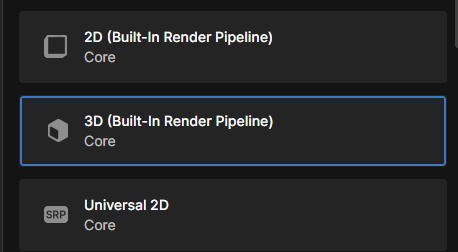
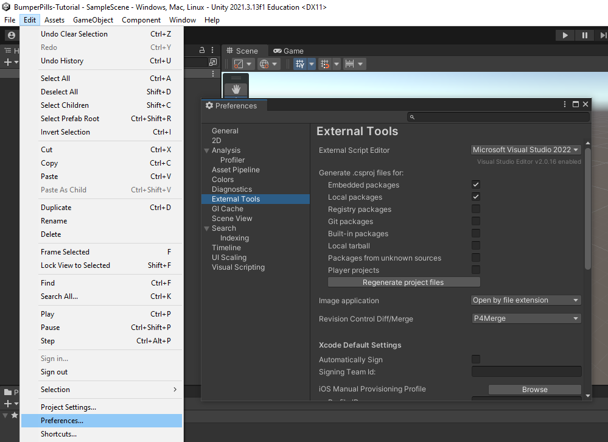
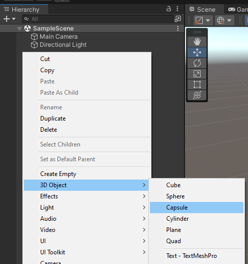
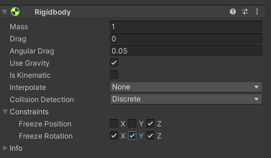
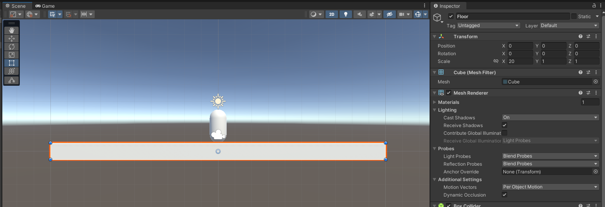
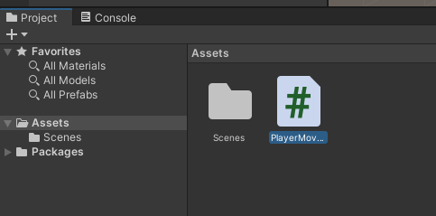

# BumperPills-Tutorial

## Introduction
> Students typically have no experience with programming or game development coming in, take things slowly and simply. Don't forget to give them time to type slower than you.

- Briefly explain programming in general
  - It's a language, and we use it to communicate with computers.
  - It has grammar and rules that we have to follow for it to do what we want.
- Explain Unity, and the idea of a game engine as a tool
- Create a fresh project from the 3D template (Built-in Render Pipeline is fine, no need for anything fancy)

- Ensure external editor is set to Visual Studio so that code completion is available (Edit > Preferences > External Tools > External Script Editor > Microsoft Visual Studio 2022)

- Explain the Unity interface
  - Heirarchy
  - Project view
  - Console
  - Inspector

## Tutorial

### Create the player
> Games aren't much fun without a player, let's get one in the scene

- Create a capsule in the heirarchy


  - Name it "Player"
  - Reset its transform so that it is at origin with no rotation and a scale of 1
- Add a Rigidbody to the player
  - Explain the purpose of the Rigidbody (It allows us to move the player, and gives us physics and gravity)
- Set constraints on the Rigidbody
  - Freeze position on the Z-Axis
  - Freeze rotation on all axes
  - 

### Create a floor for our player to stand on
> Without a floor, our player will just fall forever! Let's fix that

- Create a cube in the heirarchy
  - Name it "Floor"
  - Reset its transform so that it is at origin with no rotation and a scale of 1
  - Scale along the X-Axis by 20 to create a suitable surface to walk on
  - Move the player up 1.5 units on the Y-axis so that it sits above the ground


### Add movement to our player
> A player that can't move is boring, let's get it going

- Create a new C# Script and name it "PlayerMovement"
  - Explain that script names must not have spaces in them
 

- Open the script in visual studio
  - Ensure that the name of the class matches the name of the file, or the script will not compile
- Explain Visual Studio as a code editor
- Explain Start and Update
- In Update, get the attached Rigidbody and add force on the X-Axis
```cs
using UnityEngine;

public class PlayerMovement : MonoBehaviour
{
    // Start is called before the first frame update
    void Start()
    {
        
    }

    // Update is called once per frame
    void Update()
    {
        GetComponent<Rigidbody>().AddForce(new Vector3(1000, 0, 0) * Time.deltaTime);
    }
}
```

### Add user input
> If I can't control the player, it isn't really a game. Let's fix that

- We're moving, but we want to control it
- Separate out the vector into its own force variable
  - Explain what variables are and how they are used
  - *Very* simple explanation of scope ("Because I created this variable in update, I can use it in update but not outside")
```cs
    void Update()
    {
        Vector3 force = new Vector3(1000, 0, 0);
        GetComponent<Rigidbody>().AddForce(force * Time.deltaTime);
    }
```
- Get the user's input on the A and D keys and multiply it into the force to give us control
  - Explain the concept of an if statement
```cs
    void Update()
    {
        // Horizontal movement
        int direction = 0;
        if (Input.GetKey(KeyCode.A))
        {
            direction = -1;
        }
        else if (Input.GetKey(KeyCode.D))
        {
            direction = 1;
        }
        else
        {
            direction = 0;
        }

        Vector3 force = new Vector3(1000, 0, 0) * direction;
        GetComponent<Rigidbody>().AddForce(force * Time.deltaTime);
    }
```
- We can now move left and right!
- Extract the speed into a public variable that we can set in the inspector
```cs
public class PlayerMovement : MonoBehaviour
{
    public float Speed = 1000;

    // Start is called before the first frame update
    void Start()
    {
        
    }

    // Update is called once per frame
    void Update()
    {
        // Horizontal movement
        int direction = 0;
        if (Input.GetKey(KeyCode.A))
        {
            direction = -1;
        }
        else if (Input.GetKey(KeyCode.D))
        {
            direction = 1;
        }
        else
        {
            direction = 0;
        }

        Vector3 force = new Vector3(Speed, 0, 0) * direction;
        GetComponent<Rigidbody>().AddForce(force * Time.deltaTime);
    }
}
```

### Add jumping
> Weeeee

- Create a if statement to jump when the W key is pressed
```cs
public class PlayerMovement : MonoBehaviour
{
    public float Speed = 1000;
    public float JumpForce = 300;

    // Start is called before the first frame update
    void Start()
    {
        
    }

    // Update is called once per frame
    void Update()
    {
        // Jump
        if (Input.GetKeyDown(KeyCode.W))
        {
            GetComponent<Rigidbody>().AddForce(new Vector3(0, JumpForce, 0));
        }

        // Horizontal movement
        int direction = 0;
        if (Input.GetKey(KeyCode.A))
        {
            direction = -1;
        }
        else if (Input.GetKey(KeyCode.D))
        {
            direction = 1;
        }
        else
        {
            direction = 0;
        }

        Vector3 force = new Vector3(Speed, 0, 0) * direction;
        GetComponent<Rigidbody>().AddForce(force * Time.deltaTime);
    }
}
```

### (Optional) Remove double jumping
> Flying can be fun! Stopping it is somewhat involved, and in the interest of keeping the game simple I chose to just leave it in.
>
> Preventing a double jump involves a ground check and potentially getting into collision layers. If there's time, feel free.

### Create a second player
> Double the players, double the fun

- Create a boolean member variable called `IsPlayerOne`
- Create three boolean variables at the top of Update called `leftInput`, `rightInput`, and `jumpInput`
- If `IsPlayerOne` is true, set these booleans to player one's keys, and if not, then player two's
```cs
    public float Speed = 1000;
    public float JumpForce = 300;
    public bool IsPlayerOne = true;
    // ...

    void Update()
    {
        bool leftInput;
        bool rightInput;
        bool jumpInput;

        if (IsPlayerOne)
        {
            leftInput = Input.GetKey(KeyCode.A);
            rightInput = Input.GetKey(KeyCode.D);
            jumpInput = Input.GetKeyDown(KeyCode.W);
        }
        else
        {
            leftInput = Input.GetKey(KeyCode.LeftArrow);
            rightInput = Input.GetKey(KeyCode.RightArrow);
            jumpInput = Input.GetKeyDown(KeyCode.UpArrow);
        }

        // ...
    }
```
- Replace current uses of keycodes with these booleans instead
```cs
    void Update()
    {
        // ...

        // Jump
        if (jumpInput)
        {
            GetComponent<Rigidbody>().AddForce(new Vector3(0, JumpForce, 0));
        }

        // Horizontal movement
        int direction = 0;
        if (leftInput)
        {
            direction = -1;
        }
        else if (rightInput)
        {
            direction = 1;
        }
        else
        {
            direction = 0;
        }

        // ...
    }
```
- Return to the Unity editor
- Drag the player into the project view to make it a prefab
- Duplicate the player
- Set `IsPlayerOne` to false on the second player
- We have local multiplayer!
- Don't forget to prefab the player so we can make changes to both!

### Add some knockback
> Games are more fun if there's a bit of risk involved, so let's give the players a way to fight each other

- Create a new C# Script called PlayerKnockback
- Open it up in Visual Studio
- Remove the default code